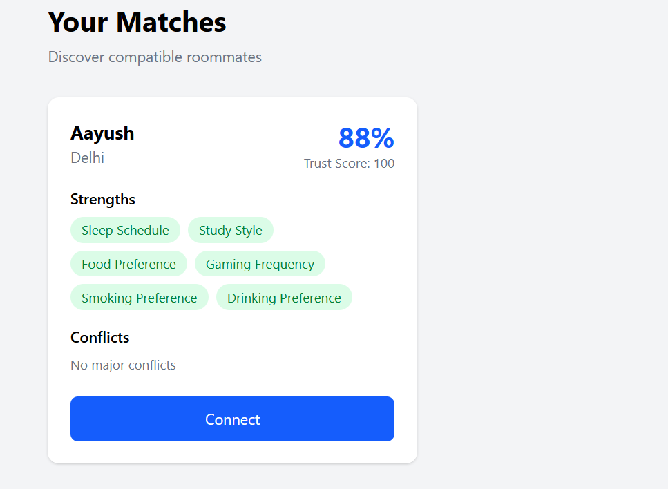
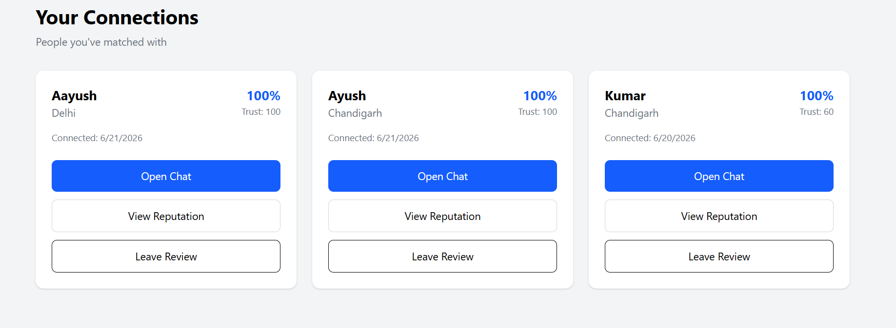
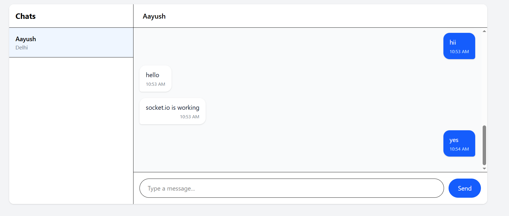
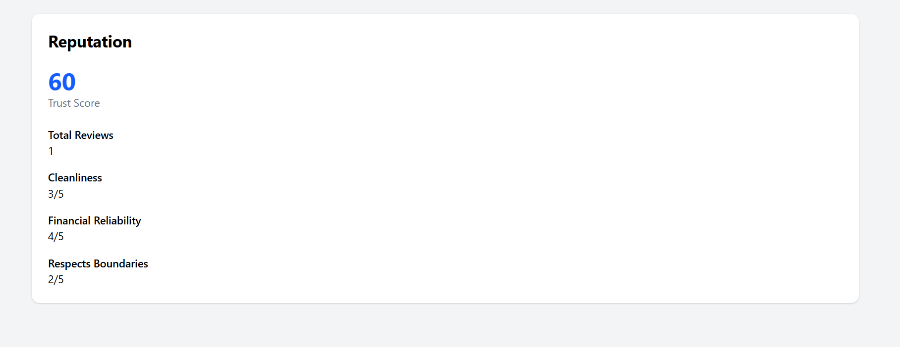

# RoomRadar

RoomRadar is a full-stack roommate matching platform that helps students, interns, and young professionals discover compatible roommates based on lifestyle preferences rather than random room sharing.

Unlike traditional room-finding platforms, RoomRadar focuses on compatibility-driven matching using a weighted preference engine, trust scores, reviews, and real-time communication.


## Features

### Authentication & User Management

* User Registration & Login
* JWT Authentication
* Secure HTTP-Only Cookies
* Protected Routes
* Profile Completion Workflow

### Compatibility Matching Engine

RoomRadar calculates compatibility using a weighted preference vector system.

Users define:

* Sleep Schedule
* Cleanliness
* Study Style
* Noise Tolerance
* Guest Frequency
* Food Preference
* Gaming Frequency
* Smoking Preference
* Drinking Preference
* AC Preference

Each preference contains:

* Value (1–10)
* Importance Weight (1–5)

The matching engine:

* Computes weighted compatibility scores
* Detects strengths
* Detects conflicts
* Filters by city
* Filters by budget overlap
* Incorporates trust score boosting

### Connection System

* Send Connection Requests
* Incoming Requests
* Sent Requests
* Accept Requests
* Reject Requests
* Accepted Connections

### Real-Time Chat

* One-to-One Chat Rooms
* Automatic Chat Room Creation
* Real-Time Messaging using Socket.IO
* Message Persistence
* Read Receipts
* Chat History
* WhatsApp-Style Chat Interface

### Reputation & Review System

Users can review former roommates and connections.

Review Categories:

* Cleanliness
* Financial Reliability
* Respects Boundaries

Features:

* Trust Score
* Average Ratings
* Review Count
* Reputation Dashboard


## Screenshots

### Matches



### Connections



### Real-Time Chat



### Reputation System




## Tech Stack

### Frontend

* React.js
* React Router
* Axios
* Tailwind CSS
* Context API
* Socket.IO Client

### Backend

* Node.js
* Express.js
* MongoDB
* Mongoose
* JWT Authentication
* Socket.IO
* Zod Validation


## Project Structure

```text
RoomRadar/
│
├── Backend/
│   ├── src/
│   │   ├── controllers/
│   │   ├── models/
│   │   ├── routes/
│   │   ├── middleware/
│   │   ├── validators/
│   │   ├── services/
│   │   ├── socket/
│   │   └── utils/
│   │
│   └── package.json
│
├── roomradar-frontend/
│   ├── src/
│   │   ├── pages/
│   │   ├── components/
│   │   ├── layouts/
│   │   ├── services/
│   │   ├── context/
│   │   └── socket/
│   │
│   └── package.json
│
└── README.md
```


## Core Workflow

```text
User Registration
        ↓
Profile Setup
        ↓
Compatibility Matching
        ↓
Connection Request
        ↓
Accept Connection
        ↓
Automatic Chat Room Creation
        ↓
Real-Time Messaging
        ↓
Reviews & Reputation
```


## Matching Algorithm Overview

The compatibility engine calculates similarity between users using weighted scoring.

For each lifestyle attribute:

text
Similarity = 0 → Completely Different
Similarity = 100 → Identical


The final compatibility score is generated using:

* Weighted average similarity
* Preference importance weights
* Strength detection
* Conflict detection
* Trust score boosting


## API Highlights

### Authentication

```http
POST /api/auth/register
POST /api/auth/login
POST /api/auth/logout
GET  /api/auth/me
```


### Profile

```http
GET  /api/users/profile
PUT  /api/users/profile
GET  /api/users/:userId
```


### Matching

```http
GET /api/matches
```


### Connections

```http
POST /api/connections/request
GET  /api/connections/requests
GET  /api/connections/sent
GET  /api/connections
PUT  /api/connections/:connectionId/accept
PUT  /api/connections/:connectionId/reject
```


### Chat

```http
GET  /api/chat/rooms
GET  /api/chat/:roomId/messages
POST /api/chat/:roomId/messages
PUT  /api/chat/:roomId/read
```

### Reviews

```http
POST /api/reviews
GET  /api/users/:userId/reputation
```


## Current Status

### Completed

* Authentication System
* User Profiles
* Compatibility Engine
* Connection Management
* Chat System
* Reviews & Reputation
* Socket.IO Integration
* Frontend MVP

### Planned Improvements

* Online Presence
* Typing Indicators
* Unread Message Counts
* Enhanced Matching Filters
* Cloudinary Profile Images
* Advanced Reputation Analytics


## Installation

### Backend

```bash
cd Backend

npm install

npm run dev
```


### Frontend

```bash
cd roomradar-frontend

npm install

npm run dev
```


## Environment Variables

### Backend

```env
PORT=5000

MONGODB_URI=your_mongodb_connection_string

JWT_SECRET=your_jwt_secret

CLIENT_URL=http://localhost:5173
```


### Frontend

```env
VITE_API_URL=http://localhost:5000/api

VITE_SOCKET_URL=http://localhost:5000
```


## Future Scope

RoomRadar is designed to evolve into a complete roommate discovery ecosystem featuring:

* Smart Compatibility Recommendations
* AI-Based Roommate Insights
* Verified Profiles
* Real-Time Notifications
* Property Listings
* Group Housing Support
* Advanced Trust & Reputation Models


## Author

Aayushman Kumar

B.E. Information Technology

Passionate about Full-Stack Development, System Design, Problem Solving, and Building Scalable Products.
